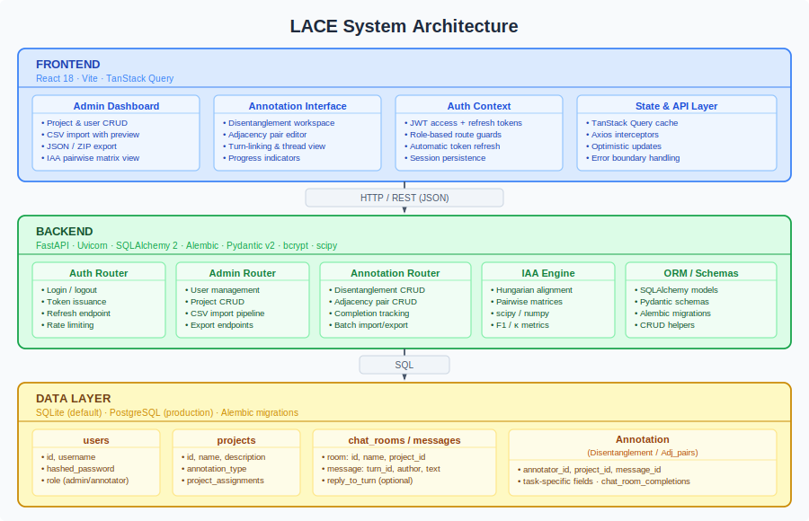

# Architecture

## System Overview

LACE is a three-tier web application. The diagram below shows the high-level structure.



---

## Tiers

### Frontend — React SPA

| Concern | Technology |
|---|---|
| UI framework | React 18 |
| Build tool | Vite |
| Server-state cache | TanStack Query v5 |
| HTTP client | Axios with interceptors |
| Routing | React Router v6 |

The SPA is compiled to static assets and served by Nginx (Docker) or `vite preview` (development). Two workspaces are provided:

- **Admin Dashboard** — project creation, user management, CSV import with row-level preview, JSON/ZIP export, IAA pairwise matrix viewer.
- **Annotation Interface** — chat-style view for disentanglement (thread colour assignment) or adjacency pair drawing (drag/right-click directed links).

Authentication state lives in a React context: the access token is stored in memory; the `httpOnly` refresh-token cookie is used to obtain new tokens silently. Role-based route guards block annotators from admin endpoints.

### Backend — FastAPI

| Concern | Technology |
|---|---|
| Framework | FastAPI 0.110+ |
| ASGI server | Uvicorn |
| ORM | SQLAlchemy 2 |
| Migrations | Alembic |
| Schema validation | Pydantic v2 |
| Password hashing | bcrypt via passlib |
| Numerical computation | scipy, numpy |

The API under `/api/v1/` is split into four routers:

- **Auth** — login, logout, token refresh, rate limiting.
- **Admin** — CRUD for users and projects; CSV parsing and bulk import; JSON/ZIP export.
- **Annotation** — read/write for disentanglement threads and adjacency pairs; room completion.
- **IAA** — on-demand pairwise F1 and Cohen's κ using the Hungarian algorithm.

### Data Layer

LACE defaults to **SQLite** for zero-configuration local use and supports **PostgreSQL** for production. Schema changes are managed via **Alembic** migrations; no manual DDL is required.

---

## Database Schema

| Table | Purpose |
|---|---|
| `users` | Credentials, hashed passwords, role (`admin` / `annotator`) |
| `projects` | Project metadata, annotation type (`disentanglement` / `adjacency`) |
| `project_assignments` | Many-to-many join between users and projects |
| `chat_rooms` | Individual conversation units within a project |
| `chat_messages` | Ordered turns within a chat room (author, text, reply link) |
| `disentanglement_annotation` | Maps each message to a thread ID per annotator |
| `adj_pairs_annotation` | Directed typed edge between two messages per annotator |
| `chat_room_completions` | Tracks which annotator has marked which room as complete |

---

## IAA — Hungarian Algorithm

Inter-annotator agreement for disentanglement is non-trivial: two annotators may identify the same threads but assign them arbitrary different IDs. LACE resolves this via **optimal thread alignment**:

1. For each annotator pair *(A, B)* on a room, collect all thread labels assigned by each.
2. Build a cost matrix *C* where *C[i][j]* = 1 − F1(thread *i* of A, thread *j* of B).
3. Run `scipy.optimize.linear_sum_assignment` on *C* to find the bijective mapping maximising total F1.
4. Compute macro-average F1 across matched thread pairs as the room-level score.
5. Aggregate room scores into a project-level pairwise matrix.

Cohen's κ is computed at the message level (using the aligned thread label as the nominal category) to provide a chance-corrected agreement measure.

---

## Code Layout

```
annotation-backend/
├── app/
│   ├── api/          # FastAPI routers — routing, validation, HTTP responses
│   │   ├── auth.py
│   │   ├── admin.py
│   │   ├── annotations.py
│   │   └── adjacency_pairs.py
│   ├── models.py     # SQLAlchemy ORM models
│   ├── schemas.py    # Pydantic v2 request/response models
│   ├── crud.py       # All database access functions
│   ├── auth.py       # JWT logic and password hashing
│   ├── config.py     # pydantic-settings configuration
│   └── main.py       # Application factory, middleware, router registration
└── alembic/          # Database migrations

annotation_ui/
├── src/
│   ├── components/   # Reusable UI components
│   ├── pages/        # Route-level views (Admin, Annotation workspaces)
│   ├── hooks/        # TanStack Query data-fetching hooks
│   └── api/          # Axios client and endpoint wrappers
└── vite.config.ts

conversion_tools/     # Excel/CSV batch-import utilities
```

---

## Docker Deployment

```
┌─────────────────────────────────────────────────────┐
│  Docker Compose                                      │
│                                                      │
│  ┌──────────────┐     ┌──────────────────────────┐  │
│  │  nginx       │────▶│  annotation_ui           │  │
│  │  :80 / :443  │     │  (static build, :3000)   │  │
│  └──────┬───────┘     └──────────────────────────┘  │
│         │ /api/*                                     │
│         ▼                                            │
│  ┌──────────────┐     ┌──────────────────────────┐  │
│  │  backend     │────▶│  db (PostgreSQL :5432)   │  │
│  │  uvicorn :8000│    │  or mounted SQLite file  │  │
│  └──────────────┘     └──────────────────────────┘  │
└─────────────────────────────────────────────────────┘
```

Nginx terminates TLS and reverse-proxies `/api/*` to the backend container. Alembic migrations run automatically at container start via `entrypoint.sh` before Uvicorn launches.
